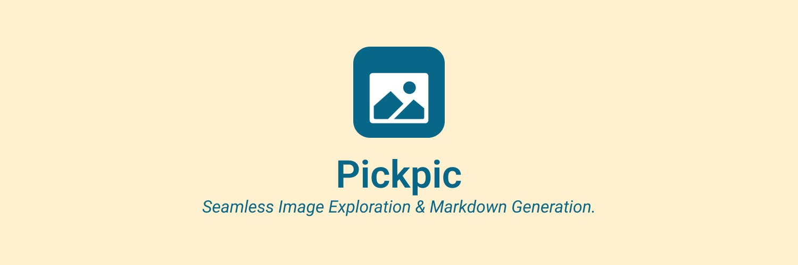

# PickPic

Seamless Image Exploration & Markdown Generation.

## Description

Pickpik simplifies the way you explore and use Unsplash images, providing instant markdown syntax to enhance your content.

It allows you to search for images, view them in a grid, and copy the markdown code for easy integration into your projects. The app is built with React and utilizes the Unsplash API for image sourcing.

It is designed to be user-friendly and efficient, making it a valuable tool for developers, bloggers, and content creators who want to enhance their work with high-quality images from Unsplash.

## Features

- Search for images from Unsplash
- Copy markdown code for easy integration
- Utilizes Unsplash API for image sourcing
- Easy to use and navigate
- Lightweight and fast
- Free to use
  